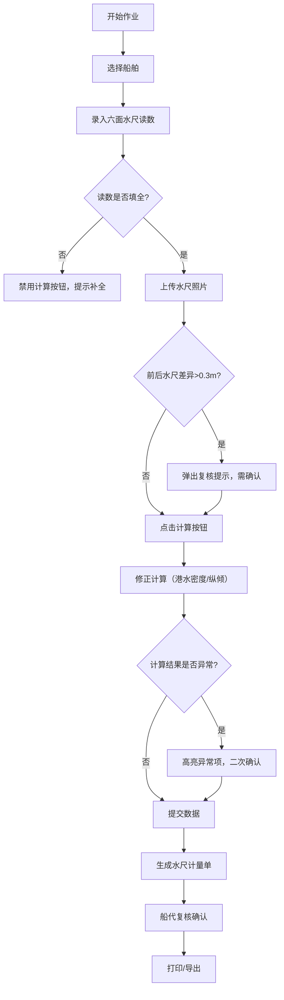

## 1. 产品概述

码头水尺读数屏Web前端系统，用于港口船舶水尺计量作业的数字化管理。解决传统人工读数误差大、流程不规范、数据追溯难的问题，通过数字化手段提升计量准确性和作业效率。目标用户为港口计量员、船代、码头调度三类角色。

## 2. 核心功能

### 2.1 用户角色

| 角色 | 注册方式 | 核心权限 |
|------|---------|---------|
| 计量员 | 系统分配账号 | 水尺读数录入、修正计算、照片上传、打印水尺单 |
| 船代 | 系统分配账号 | 查看水尺数据、复核确认、查看历史记录 |
| 码头调度 | 系统分配账号 | 查看计量进度、调度作业、查看历史对比数据 |

### 2.2 功能模块

1. **读数录入页**：六面水尺数据录入表单（前左/前右/中左/中右/后左/后右）、实时校验提示
2. **计算复核页**：排水量修正计算、异常差异复核提示、确认提交
3. **历史对比页**：历史水尺记录列表、多批次数据对比、趋势图表
4. **打印单页**：标准水尺计量单模板、预览、打印/导出PDF

### 2.3 页面详情

| 页面名称 | 模块名称 | 功能描述 |
|---------|---------|----------|
| 读数录入页 | 表单录入区 | 六面水尺读数输入框，支持数字键盘快捷输入，必填项校验 |
| 读数录入页 | 实时校验区 | 读数未填全时禁用计算按钮，前后水尺差异过大时高亮提示 |
| 读数录入页 | 照片占位区 | 六张水尺照片上传占位框，支持预览和重拍 |
| 计算复核页 | 修正计算区 | 显示排水量计算过程、港水密度修正、纵倾修正结果 |
| 计算复核页 | 复核提示区 | 异常数据红色醒目提示，需二次确认方可提交 |
| 历史对比页 | 列表查询区 | 按船名/日期/作业号查询历史记录 |
| 历史对比页 | 对比分析区 | 选择多条记录进行水尺数据横向对比 |
| 打印单页 | 模板预览区 | 标准水尺计量单样式预览，含船舶信息、水尺数据、计算结果、签字栏 |

## 3. 核心流程

计量员登录系统后，选择船舶作业，依次录入六面水尺读数（前左、前右、中左、中右、后左、后右）。系统实时校验：如读数未填全则禁用计算按钮；如前后水尺差异超过阈值（默认0.3米）则弹出复核提示。录入完成后上传六张对应位置的水尺照片，点击计算按钮进行排水量修正计算。计算完成后系统再次校验异常数据，如确认无误则提交生成水尺计量单。船代可登录复核确认，码头调度可查看作业进度和历史数据。最终生成的水尺单支持打印和导出。

## 4. 用户界面设计

### 4.1 设计风格
- **主色调**：深海蓝 `#1e3a5f`，体现港口行业特性
- **辅助色**：警示橙 `#f59e0b`、成功绿 `#10b981`、危险红 `#ef4444`
- **按钮风格**：扁平化设计，圆角8px，悬停有轻微阴影提升
- **字体**：标题使用思源黑体 Bold，正文使用思源宋体 Regular，数字使用等宽字体 JetBrains Mono
- **布局风格**：顶部导航栏 + 左侧角色菜单 + 右侧内容区的三栏布局，数据卡片式展示
- **图标**：使用线性图标，大小统一为18px，颜色与主色调一致

### 4.2 页面设计概述

| 页面名称 | 模块名称 | UI元素 |
|---------|---------|--------|
| 读数录入页 | 表单录入区 | 网格布局，6个数字输入框，标签+单位+输入框组合，聚焦时有蓝色边框高亮 |
| 读数录入页 | 实时校验区 | 顶部通知条，红色背景配白色图标文字，抖动动画提示异常 |
| 读数录入页 | 照片占位区 | 3×2网格布局，占位框含虚线边框和相机图标，上传后显示缩略图 |
| 计算复核页 | 修正计算区 | 分步展示计算过程，每步显示公式、参数、结果，关键数字加大加粗 |
| 计算复核页 | 复核提示区 | 模态对话框，红色标题+详细说明+确认/取消按钮，遮罩层半透明 |
| 历史对比页 | 列表查询区 | 表格展示，斑马纹背景，悬停高亮，支持列排序 |
| 历史对比页 | 对比分析区 | 横向条形图，不同批次用不同颜色区分，数值标签显示在条形末端 |
| 打印单页 | 模板预览区 | 白色背景模拟A4纸张，灰色边框，底部有打印/导出按钮组 |

### 4.3 响应式

采用桌面端优先设计，主内容区最小宽度1200px。平板端（768-1200px）左侧菜单可折叠收起，手机端（<768px）采用底部标签栏导航，表单单列布局。所有触摸交互区域不小于44×44px。

### 4.4 动效设计

- 页面加载：内容区从下向上滑入，延迟100ms后渐显
- 按钮交互：点击时缩小到95%再回弹，过渡时长150ms
- 表单校验：错误提示框轻微左右抖动（translateX -5px → +5px → 0）
- 数据更新：数值变化时数字滚动动画，从旧值平滑过渡到新值
