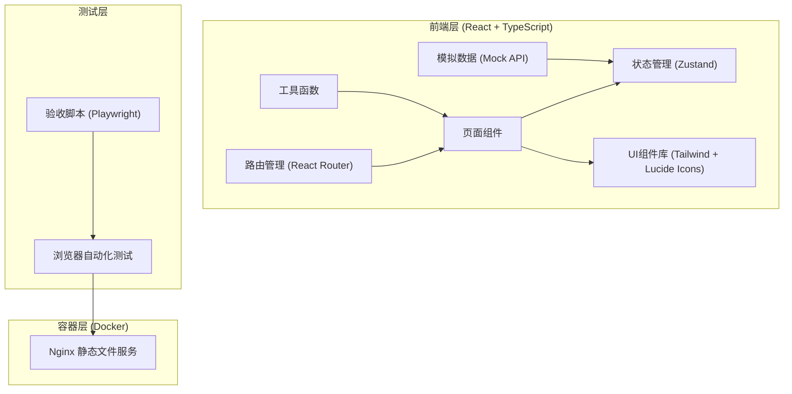
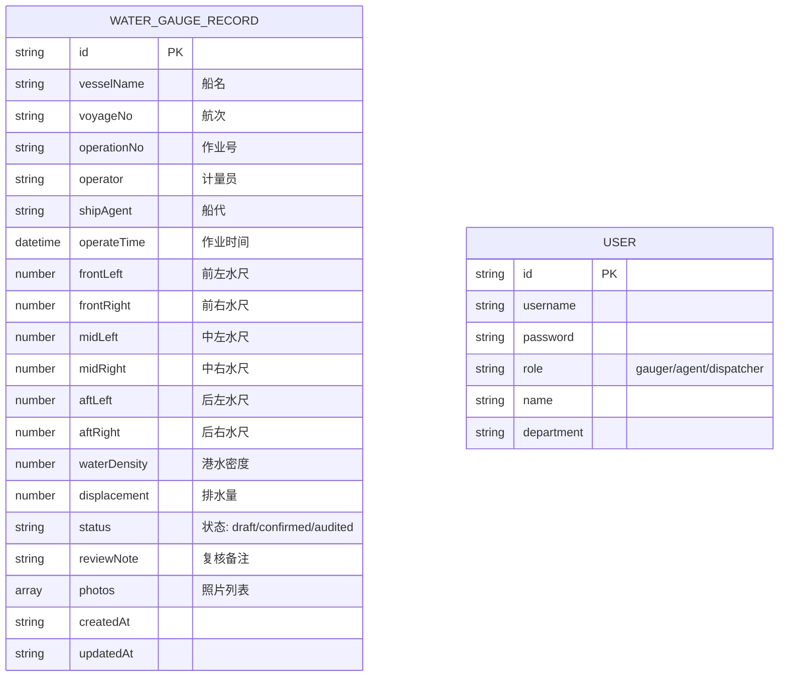

## 1. 架构设计



## 2. 技术描述

- **前端**：React@18 + TypeScript@5 + Vite@5 + React Router@6 + Zustand@4 + TailwindCSS@3 + Lucide React@0.294
- **数据层**：纯前端模拟数据，使用TypeScript接口定义数据模型，本地localStorage持久化
- **样式**：TailwindCSS 3 原子化CSS，自定义主题配置
- **图表**：Recharts@2 用于历史数据对比图表
- **打印**：react-to-print@2 + 自定义打印样式
- **容器**：Docker + Nginx 部署静态资源
- **测试**：Playwright@1 用于端到端验收测试

## 3. 路由定义

| 路由 | 页面 | 权限角色 |
|-----|-----|---------|
| `/login` | 登录页 | 所有 |
| `/reading` | 读数录入页 | 计量员 |
| `/calculate` | 计算复核页 | 计量员、船代 |
| `/history` | 历史对比页 | 计量员、船代、码头调度 |
| `/print/:id` | 打印单页 | 计量员、船代、码头调度 |
| `/dashboard` | 调度看板 | 码头调度 |

## 4. 数据模型

### 4.1 数据模型定义



### 4.2 TypeScript 类型定义

```typescript
// 水尺读数记录
interface WaterGaugeRecord {
  id: string;
  vesselName: string;
  voyageNo: string;
  operationNo: string;
  operator: string;
  shipAgent: string;
  operateTime: string;
  frontLeft: number | null;
  frontRight: number | null;
  midLeft: number | null;
  midRight: number | null;
  aftLeft: number | null;
  aftRight: number | null;
  waterDensity: number;
  displacement?: number;
  correction?: {
    trimCorrection: number;
    densityCorrection: number;
    finalDisplacement: number;
  };
  status: 'draft' | 'confirmed' | 'audited';
  reviewNote?: string;
  photos: PhotoInfo[];
  createdAt: string;
  updatedAt: string;
}

// 照片信息
interface PhotoInfo {
  position: 'frontLeft' | 'frontRight' | 'midLeft' | 'midRight' | 'aftLeft' | 'aftRight';
  url: string;
  uploadedAt: string;
}

// 用户信息
interface User {
  id: string;
  username: string;
  role: 'gauger' | 'agent' | 'dispatcher';
  name: string;
  department: string;
}

// 校验结果
interface ValidationResult {
  isValid: boolean;
  errors: string[];
  warnings: string[];
  needsReview: boolean;
  reviewMessage?: string;
}

// 计算结果
interface CalculationResult {
  meanDraft: number;
  trim: number;
  displacement: number;
  trimCorrection: number;
  densityCorrection: number;
  finalDisplacement: number;
}
```

## 5. 前端模块结构

```
src/
├── components/          # 公共组件
│   ├── Layout/         # 布局组件
│   ├── Form/           # 表单组件
│   ├── PhotoUpload/    # 照片上传组件
│   ├── ReviewModal/    # 复核对话框
│   └── PrintTemplate/  # 打印模板
├── pages/              # 页面组件
│   ├── Login.tsx
│   ├── Reading.tsx
│   ├── Calculate.tsx
│   ├── History.tsx
│   ├── Print.tsx
│   └── Dashboard.tsx
├── store/              # 状态管理
│   ├── useAuthStore.ts
│   ├── useGaugeStore.ts
│   └── useHistoryStore.ts
├── utils/              # 工具函数
│   ├── validation.ts   # 校验逻辑
│   ├── calculation.ts  # 计算逻辑
│   └── mock.ts         # 模拟数据
├── types/              # 类型定义
│   └── index.ts
├── hooks/              # 自定义Hooks
│   ├── useValidation.ts
│   └── useCalculation.ts
├── App.tsx
├── main.tsx
└── router.tsx
```

## 6. 核心校验与计算规则

### 6.1 校验规则
- **必填校验**：六面水尺读数必须全部填写且为有效数字（0-30米范围）
- **差异校验**：前后水尺平均值差异 > 0.3米时，触发复核提示
- **左右校验**：同一截面左右差异 > 0.1米时，给出警告提示
- **计算限制**：校验不通过时，禁用"计算"按钮

### 6.2 计算规则
- **平均吃水**：(前左 + 前右 + 中左 + 中右 + 后左 + 后右) / 6
- **纵倾值**：后平均吃水 - 前平均吃水
- **纵倾修正**：根据船舶静水力曲线查询修正值（模拟）
- **密度修正**：标准排水量 × (港水密度 / 1.025)
- **最终排水量**：标准排水量 + 纵倾修正 + 密度修正

## 7. 容器化配置

使用多阶段构建：
1. 第一阶段：Node.js 环境构建前端资源
2. 第二阶段：Nginx 环境提供静态文件服务

Dockerfile 包含：
- Node 20 Alpine 构建镜像
- Nginx Alpine 运行镜像
- 健康检查配置
- 80端口暴露

docker-compose.yml 包含：
- web 服务（前端应用）
- 端口映射 3000:80
- 健康检查
- 重启策略

## 8. 验收脚本

使用 Playwright 编写端到端测试脚本，覆盖以下场景：
1. 正常流程：完整录入六面水尺 → 计算 → 提交
2. 异常场景1：读数未填全，验证计算按钮禁用
3. 异常场景2：前后水尺差异过大（>0.3m），验证复核提示出现
4. 历史对比：查询历史记录，选择多条对比
5. 打印功能：预览打印单，验证内容完整性

脚本输出：测试通过/失败报告，截图留存。
